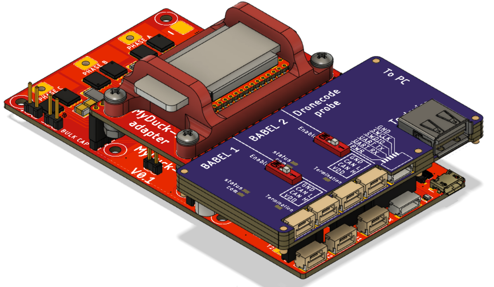

# Babel-Babel

All-in-one hardware solution for developing [Cyphal/CAN](https://opencyphal.org) and DroneCAN devices.

Babel-Babel consists of three devices that are assembled on a single PCB:
2x [Babel](https://zubax.com/babel) USB-CAN adapters and a
[Dronecode probe](https://shop.zubax.com/collections/development-tools/products/dronecode-probe-v2-2-jtag-swd-adapter-usb-uart-adapter-with-dcd-m-cable)
(a generic JTAG/SWD + UART console adapter).

Babel-Babel is connected to the PC with a single USB cable as it contains a built-in USB hub.
It provides the following interfaces for connecting to the device under development:

- CAN 1 (UCANPHY Micro connector)
- CAN 2 (UCANPHY Micro connector)
- SWD and UART (Dronecode Debug connector, medium)
- USB (regular USB A connector)

Along with that, all these interfaces are routed to additional PLS connectors (regular 0.1' single-row pin headers).
These connectors may be used for production testing purposes.

Each Babel can be turned off using the corresponding dip switch.

For technical characteristics, please refer to [requirements document](/docs/requirements.md).

## Standalone debug tool

When the device is used as a standalone debug tool (when the pin headers are not used),
Babel-Babel is constructed using a "novel approach" often called oreo-construction.
This approach eliminates the need for having separate housing,
reliably protecting all the electronics inside the device
while also providing a possibility to deposit some explanatory notes on the top surface of the device
(like the purpose of connectors, pinouts, etc.) without any additional technological processes,
which allows Babel-Babel to be a relatively self-documenting device.

## Production flashing tool

To use Babel-Babel as a production flashing and testing tool, an adapter PCB should be designed.
In general, such PCB should have PBS connectors for Babel-Babel on one side and some connectors
for the device under test (usually pogo pins).
Both Babel-Babel and the device under test can then be connected to this adapter PCB and
the flashing and testing routine can be performed.

Although using Babel-Babel for testing requires some preparations,
it still may be beneficial as it greatly reduces the total amount of
wiring and connectors involved in the production testing routine.
This, in turn, makes the process faster, more reliable, and less painstaking.

The [Mitochondrik-LV](https://zubax.com/mitochondrik-lv) evaluation board is a good example.
To eliminate additional adapter PCBs, the evaluation board is designed to host Babel-Babel directly:

## Manufacturing instructions

For details on the manufacturing process of the device, check the
instructions at [manufacturing document](/docs/manufacturing.md).

## Release notes

Newest entries at the top.

### v1.2.1 (2023)

* Replaced enclosure PCBs with 3D.
* Added Zubax logo to main PCB.

### v1.2 (2023)

* Fixed silkscreen labels and BOM inconsistencies.
* Replaced references to UAVCAN with Cyphal/CAN.

### v1.1 (2023)

* CAN VDD pulled high with resistor.
* Bootloader switch added to DCP with added pulup resistor.
* CAN VBUS voltage measurement implemented.

### v1.0 (2021)

The original version.
