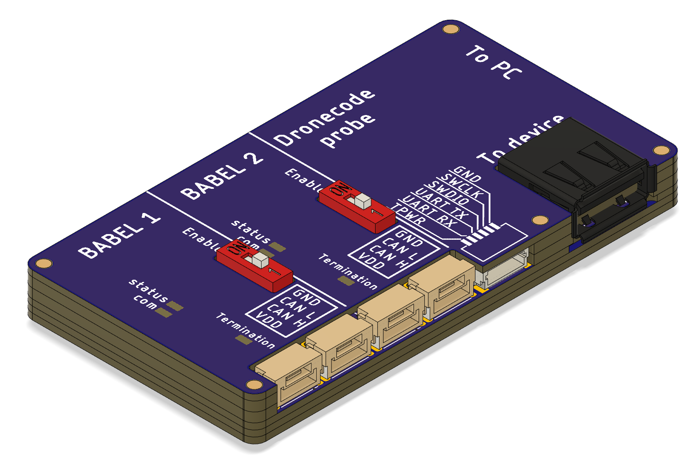
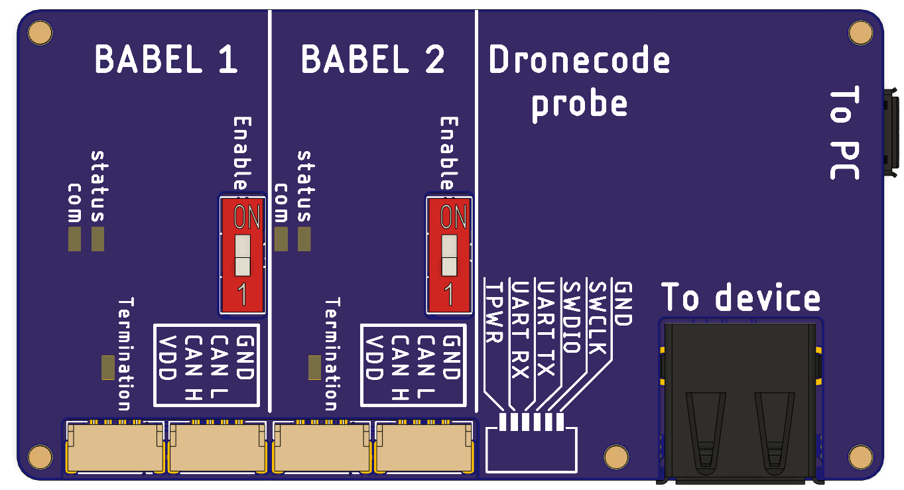

# Babel-Babel
All-in-one hardware solution for developing UAVCAN-compatible devices.

Babel-Babel consists of three devices that are assembled on a single PCB: 2 Babel UAB-CAN adapters and dronecode probe (a generic JTAG/SWD + UART console adapter).

Babel-Babel is connected to a PC with only one USB cable as it contains a USB HUB. It provides the following interfaces for connecting to a device under development:
- CAN 1 (UAVCAN micro connector)
- CAN 2 (UAVCAN micro connector)
- SWD and UART (DroneCode Debug connector, medium)
- USB (regular USB A connector)

Along with that, all these interfaces are connected to additional PLS connectors (regular 0.1` single row pin headers). 
These connectors may be used for production testing purposes.

Each individual Babel can be turned off using the corresponding dip switch. CAN bus termination resistor on each individual Babel can also be connected to the bus 
using a corresponding dip switch.

In standalone debugging tool using scenario (when pin headers are not used) Babel-Babel is constructed using a "novel approach" often called oreo-construction.
This eliminates the need for having a separate housing, reliably protecting all the electronics inside the device
while also providing a possibility to deposit some explanatory notes on the top surface of the device 
(like connectors purpose, pinouts, etc.) without additional technological process, which allows Babel-Babel to be a relatively self-documented device.

In order to use Babel-Babel as production flashing and testing tool, an adapter PCB should be designed.
In general, this PCB should have PBS connectors for Babel-Babel on one side and some sort of connectors for the device under test (usually pogo pins).
Both Babel-Babel and device under test can then be connected to this adapter PCB and the flashing and testing routine can be performed.
A good example of this practice is Myduck-LV.
It is a device used to flash and test Mitochondrik LV.
In order to avoid the requirement for an additional adapter PCB Myduck LV is designed to accept Babel-Babel directly: 

