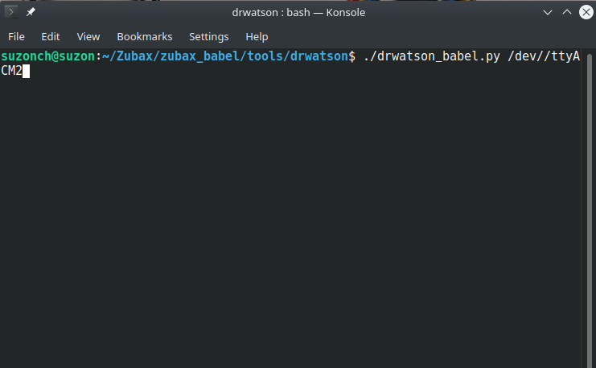
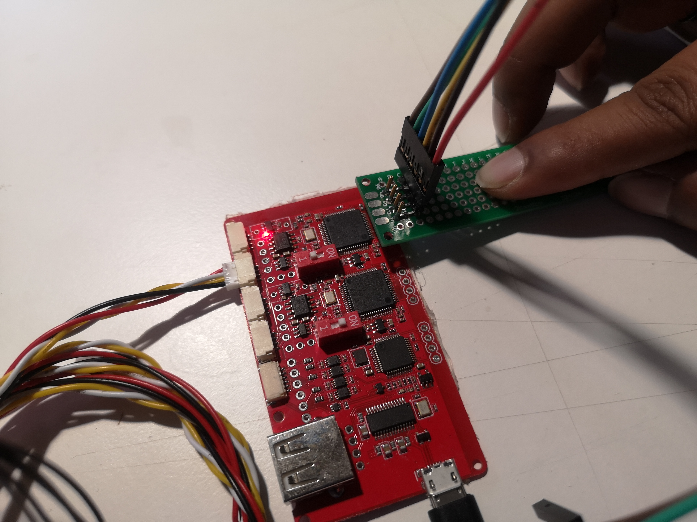

# Babel-Babel manufacturing

## PCB specification for all PCB
### Main PCB

* Layers: 4 (layer stack in manufacturing package)
* Thickness: 1.0mm
* PCB color: Red
* Silkscreen: White
* Surface Finish: LeadFree HASL-RoHS
* Outer Copper Weight: 1 oz or 1.4 Mils
* Inner Copper Weight: 0.5 oz or 0.7 mils
* Material Type: FR4
* Flying Prob Test: Fully Test
* Castellated Holes: No

### Enclosure PCB

All parameters of the enclosure PCBs are the same except thickness.
Common parameters: 

* Surface Finish: LeadFree HASL-RoHS
* Color: Red
* Silkscreen: White
* Material: FR4
* No Copper

### Part B1

* Thickness: 0.8mm

### Part A

* Thickness: 1.6mm

### Part C

* Thickness: 1.2mm

### Part D

* Thickness: 0.8mm

## Manufacturing

1) SMT mounting of the main PCB.

2) Flashing both Babels and [Dronecode probe](https://github.com/Zubax/dronecode_probe) on the PCB.
This operation should be performed without installing any connectors on the PCB,
a 4-pin pogo pin connector should be used instead.
Connectors' pinouts used for flashing can be found in the picture below.

To flash Babel-Babel, the Babel part of the board has to be flashed first then the DCP part will be flashed.
To flash and test Babel, follow the procedure below:
* Turn off one babel by toggling the switch
* Connect 1 DCP and 1 Babel from PC
  

* Connect 1 CAN port from Babel to 1 port of Babel-Babel on the side that'll be flashed
* Navigate to drwatson_babel repository and run "./drwatson_babel.py (babel port path)"
 

* Hold the pogo-pins from DCP to flashing interface of Babel-Babel

* Enter provided credentials and press enter and the flashing process will start

To flash the DCP part, follow [the DCP Manufacturing documentation](https://github.com/Zubax/dronecode_probe/blob/master/MANUFACTURING.md).

1) After flashing is done, all the PCBs should be stacked, aligned,
and secured together using x5 2 mm diameter pins.
"Part A" PCBs should be split in two parts beforehand,
and the excessive material that interferes with USB A connector placement should be removed.
The pins can be manufactured by cutting widely available round wooden dowels 
with 2 mm diameter to appropriate length (7.7 mm).
The dowels can be purchased in general hardware stores 
or on [Amazon](https://www.amazon.co.uk/Wooden-Sticks-Round-Dowels-Natural/dp/B07T4ZFFHQ)
and other online shops.

## BOM for final assembly of Babel-Babel

| Name          | Quantity |
| ------------- | -------- |
| Main PCB         | 1 |
| Wood dowel       | 5 |
| Part A           | 2 |
| Part B1          | 1 |
| Part C           | 1 |
| Part D           | 1 |
